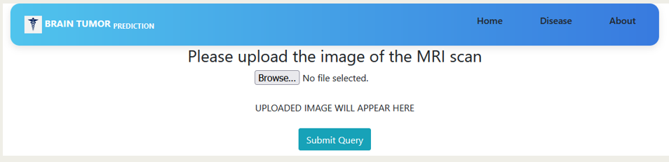

<!DOCTYPE html>
<html lang="en">
<body>

<h1>Multiple Disease Prediction using Machine Learning</h1>

Welcome to the Multiple Disease Prediction project repository! This project aims to predict multiple diseases based on patient symptoms using machine learning algorithms. The prediction model is deployed using Flask, allowing users to input symptoms and receive predictions for possible diseases.

<h2>Features</h2>
<ul>
    <li><strong>Machine Learning Model</strong>: Trained model to predict diseases based on symptoms input.</li>
    <li><strong>Flask Web Framework</strong>: Deployed using Flask to create a web interface for disease prediction.</li>
    <li><strong>Symptom Input</strong>: Users can input symptoms through a user-friendly interface.</li>
    <li><strong>Disease Prediction</strong>: Generates predictions for possible diseases based on input symptoms.</li>
    <li><strong>Scalable and Extensible</strong>: Easily extend the model with new diseases and symptoms as required.</li>
</ul>

<h2>Screenshots</h2>

<h2>Installation</h2>
<ol>
    <li>Clone the repository:
        <pre><code>git clone https://github.com/your-username/multiple-disease-prediction.git</code></pre>
    </li>
    <li>Navigate to the project directory:
        <pre><code>cd multiple-disease-prediction</code></pre>
    </li>
    <li>Set up a virtual environment and activate it:
        <pre><code>python -m venv env source env/bin/activate  # On Windows use `env\Scripts\activate`</code></pre>
    </li>
    <li>Install the required dependencies:
        <pre><code>pip install -r requirements.txt</code></pre>
    </li>
    <li>Start the Flask application:
        <pre><code>python app.py</code></pre>
    </li>
    <li>Open your web browser and go to <code>http://localhost:5000</code> to access the application.</li>
</ol>

<h2>Usage</h2>
<ol>
    <li>Enter symptoms in the provided input fields.</li>
    <li>Click on the "Predict" button to receive predictions for possible diseases.</li>
    <li>Explore additional features or extend the application by modifying Flask routes and integrating new models.</li>
</ol>

</body>
</html>
